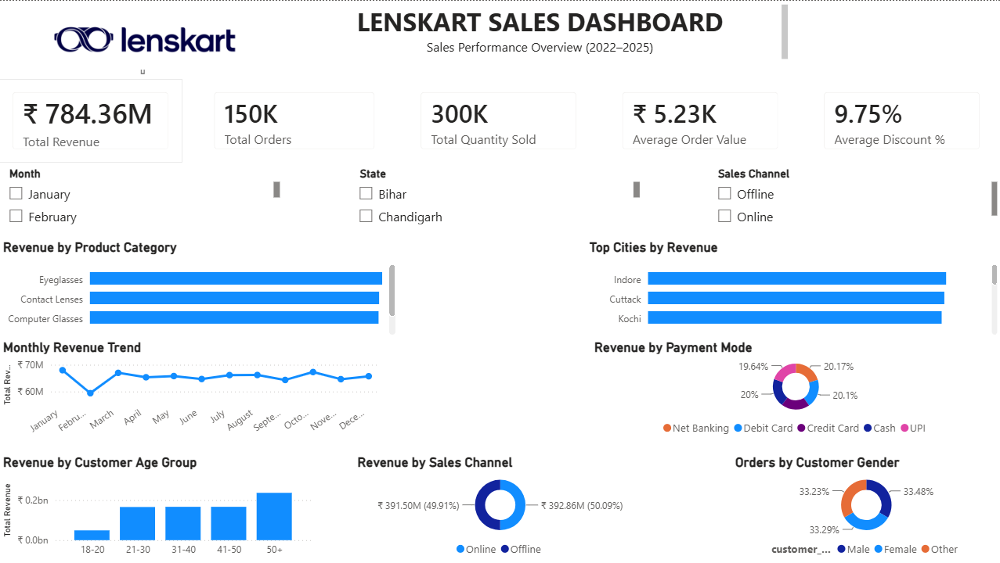

🔗 **Live Dashboard:** https://lenskartsalesanalytics-jw4vbk3f4g76zjjqsm3wjq.streamlit.app

# 👓 Lenskart Sales Analytics & Forecasting Dashboard

## 📌 Project Overview

This project is an end-to-end sales analytics solution built on 150,000+ Lenskart retail transactions. It moves from descriptive analysis to predictive forecasting to a live, AI-powered dashboard.

The workflow includes:
- Data exploration and business problem-solving using **SQL**
- Interactive dashboard development in **Power BI**
- Time-series **forecasting** using Python and scikit-learn
- A live, interactive dashboard built with **Streamlit**
- **AI-generated business insights** using the Google Gemini API

---

## 🚀 Live Dashboard Highlights

- Total Sales, Total Orders, Average Order Value (real-time KPIs)
- Monthly sales trend visualization (2022–2025)
- 3-month sales forecast using a Linear Regression model
- AI-generated business insight and actionable recommendation, refreshed on demand

---

## 📊 Power BI Dashboard Highlights

- Total Revenue, Total Orders, Total Quantity Sold
- Average Order Value, Average Discount %
- Revenue by Product Category, Sales Channel, Payment Mode
- Monthly Revenue Trend
- Top Cities by Revenue
- Orders by Customer Gender & Age Group
- Interactive Slicers (Month, State, Sales Channel)

---

## 🛠 SQL Concepts Covered

- SELECT Statements
- WHERE, ORDER BY, GROUP BY
- Aggregate Functions
- CASE Statements
- Joins (INNER, LEFT, RIGHT)
- Subqueries
- Common Table Expressions (CTEs)
- Recursive CTEs
- Window Functions
- Ranking Functions
- Running Totals
- Business Case Queries
- Sales Analysis Queries

---

## 📊 Power BI Features

- Data Modeling
- DAX Measures
- KPI Cards
- Bar Charts
- Line Charts
- Donut Charts
- Interactive Slicers
- Dashboard Design
- Data Visualization

---

## 🤖 Python, Forecasting & AI Layer

- **Data pipeline:** pandas for loading, cleaning, and aggregating monthly sales
- **Forecasting model:** scikit-learn Linear Regression trained on 48 months of sales data to predict the next 3 months of revenue
- **Key insight discovered:** a consistent sales dip every February across all 4 years, indicating a post-holiday demand slump
- **AI-generated insights:** forecast data is passed to the Google Gemini API, which generates a live business insight and actionable recommendation
- **Deployment:** the full dashboard is built with Streamlit and deployed publicly on Streamlit Community Cloud

---

## 🧰 Tools Used

- SQL (PostgreSQL)
- Power BI
- Python (pandas, scikit-learn, matplotlib)
- Streamlit
- Google Gemini API
- Git & GitHub

---

## 📂 Repository Structure

Lenskart_Sales_Analytics/
│
├── sql/
│   └── Lenskart_SQL_Queries.sql
├── powerbi/
│   └── Lenskart_Sales_Dashboard.pbix
├── python/
│   ├── fetch_data.py
│   └── forecast.py
├── images/
│   └── Dashboard.png
├── data/
│   └── Lenskart_Sales_Dataset.csv
├── app.py
├── requirements.txt
└── README.md
---

## 📈 Key Business Questions Solved

- Which product categories generate the highest revenue?
- Which cities contribute the most sales?
- Which payment methods are most preferred?
- What are the monthly sales trends, and what will the next 3 months look like?
- Which customer age groups generate maximum revenue?
- What is the average order value?
- Which sales channel performs better?
- Customer segmentation using SQL
- Ranking top-performing products and cities
- Revenue trend analysis using Window Functions
- Is there a predictable seasonal pattern the business should plan around?

---

## 📬 Author

**Kartik Mittal**

GitHub: https://github.com/Kar205tik
